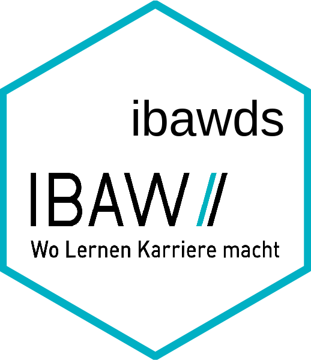

<!-- README.md is generated from README.Rmd. Please edit that file -->

# ibawds 

<!-- badges: start -->

[](https://CRAN.R-project.org/package=ibawds)
[](https://github.com/stibu81/ibawds/actions)
[](https://lifecycle.r-lib.org/articles/stages.html#experimental)
[](https://codecov.io/gh/stibu81/ibawds?branch=master)
<!-- badges: end -->

ibawds provides useful functions and datasets for the [Data Science
course at
IBAW](https://ibaw.ch/bildungsangebote/informatik/data-science/) in
Lucerne.

## Installation

You can install the released version of ibawds from
[CRAN](https://CRAN.R-project.org) with:

``` r
install.packages("ibawds")
```

And the development version from [GitHub](https://github.com/) with:

``` r
# install.packages("devtools")
devtools::install_github("stibu81/ibawds")
```
